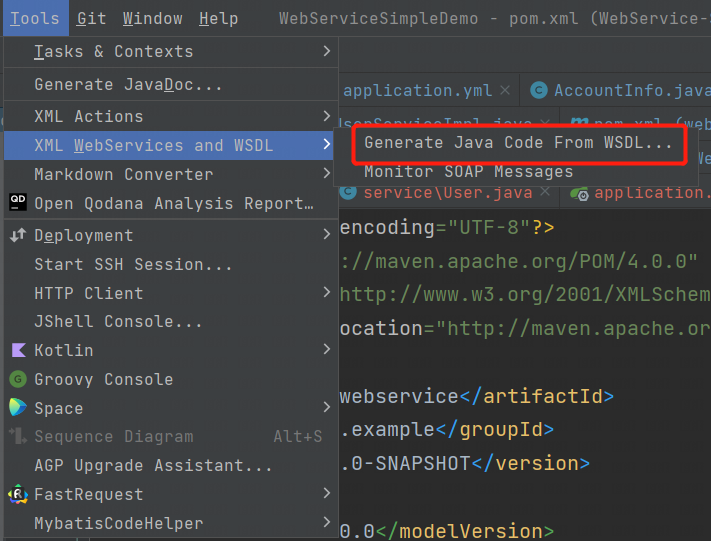
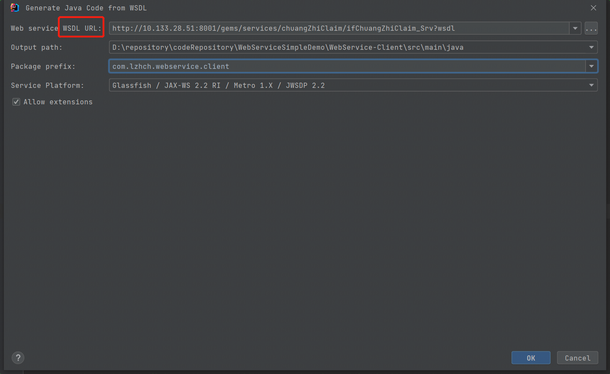

## Java 创建 WebService 服务(server+client)

[toc]

#### 一、WebService 简介

##### 1. 概念

>  WebService 也叫 `XML Web Service`，WebService 是一种可以接收从 Internet 或者 Intranet 上的其它系统中传递过来的请求，轻量级的独立的通讯技术。是通过 SOAP 在 Web 上提供的软件服务，使用 WSDL 文件进行说明，并通过 UDDI 进行注册。

简言之: WebService 是一种 **跨编程语言和跨操作系统平台的远程调用技术**。

---

##### 2. 组成

WebService 由 SOAP、WSDL、UDDI 三要素组成。

- SOAP

  WebService 通过 HTTP 协议发送请求和接收结果时，发送的请求内容和结果内容都采用 XML 格式封装，并增加了一些特定的 HTTP 消息头，以说明 HTTP 消息的内容格式，这些特定的 HTTP 消息头和 XML 内容格式就是 SOAP 协议。SOAP 提供了标准的 RPC 方法来调用 WebService。

  **SOAP协议 = HTTP协议 + XML数据格式**

  SOAP 协议可以简单地理解为：SOAP = RPC + HTTP + XML，即采用 HTTP 作为通信协议，RPC（Remote Procedure Call Protocol 远程过程调用协议）作为一致性的调用途径，XML 作为数据传送的格式，从而允许服务提供者和服务客户经过防火墙在 Internet 上进行通信交互。

- WSDL

  WSDL(Web Services Description Language) 就是这样一个基于 XML 的语言，用于描述WebService 及其函数、参数和返回值。它是 WebService 客户端和服务器端都能理解的标准格式。因为是基于 XML 的，所以 WSDL 既是机器可阅读的，又是人可阅读的，这将是一个很大的好处。一些最新的开发工具既能根据你的 Web service 生成 WSDL 文档，又能导入 WSDL 文档，生成调用相应 WebService 的代理类代码。

  WSDL 可以简单理解为就是一个接口文档，定义了服务器地址、接口名称、入参出参等信息。

- UDDI

  UDDI (Universal Description, Discovery, and Integration) 是一个主要针对 Web 服务供应商和使用者的新项目。在用户能够调用 Web 服务之前，必须确定这个服务内包含哪些商务方法，找到被调用的接口定义，还要在服务端来编制软件，UDDI 是一种根据描述文档来引导系统查找相应服务的机制。UDDI 利用 SOAP 消息机制（标准的 XML/HTTP ）来发布，编辑，浏览以及查找注册信息。它采用 XML 格式来封装各种不同类型的数据，并且发送到注册中心或者由注册中心来返回需要的数据。

----

##### 3. 原理

- 简易流程

  **<u>客户端 --> 阅读WSDL文档（了解webservice的请求） --> 调用WebService</u>** 

  上面的流程是一个大致的描述，客户端阅读 WSDL 文档发送请求，然后调用 Web 服务器最后返回给客户端，这和普通的 http 请求一样，请求->处理->响应，与普通的请求不一样的就是 webservice 请求中有一个 WSDL 文档和 SOAP 协议，以及 .NET Framework 自带的 Web Service 请求处理器 ISAPI Extension。

- 完整流程

  **<u>客户端 --> 阅读WSDL文档 (根据文档生成SOAP请求) --> 发送到Web服务器 --> 交给WebService请求处理器 （ISAPI Extension） --> 处理SOAP请求 --> 调用WebService --> 生成SOAP应答 --> Web服务器通过 http 的方式交给客户端</u>**

---

---

#### 二、 搭建 server 端

##### 1. 编写接口和实现类

正常编写接口和实现类，保证接口可用。

##### 2. 添加注解

在接口和实现类上添加注解

- 在接口和实现类上添加 @WebService 注解
- 在方法上添加 @WebMethod 注解
- 在参数上添加 @WebParam 注解

##### 3. 编写发布类

使用 EndpointImpl 类进行接口发布

##### 4. 启动

启动服务，访问已发布服务的 WSDL，能正常访问即为正常。

以 user 为例， 访问地址： http://localhost:8080/demo/user?wsdl

访问成功如下图：

##### 4. 代码示例:

服务端的参数对象正常创建即可，无特殊要求。

pom 文件:

~~~java
<dependencies>
    <dependency>
        <groupId>org.springframework.boot</groupId>
        <artifactId>spring-boot-starter</artifactId>
        <version>2.7.5</version>
    </dependency>

    <dependency>
        <groupId>org.springframework.boot</groupId>
        <artifactId>spring-boot-starter-web</artifactId>
        <version>2.7.5</version>
    </dependency>

    <dependency>
        <groupId>org.springframework.boot</groupId>
        <artifactId>spring-boot-starter-test</artifactId>
        <version>2.7.5</version>
        <scope>test</scope>
    </dependency>

    <dependency>
        <groupId>org.apache.cxf</groupId>
        <artifactId>cxf-spring-boot-starter-jaxws</artifactId>
        <version>3.5.3</version>
    </dependency>

</dependencies>
~~~

接口:

~~~java
package com.lzhch.webservice.server.service;

import com.lzhch.webservice.server.dto.User;

import javax.jws.WebMethod;
import javax.jws.WebParam;
import javax.jws.WebService;

/**
 * 发布的服务接口, 定义发布的服务方法
 *
 * @author 刘志超
 * @version 1.0.1
 * @date 2019-03-14 下午4:48:44
 */
@WebService
public interface IUserService {

    /**
     * 该类中的方法供客户端调用
     * 类上添加 @WebService 注解, 类中所有的非静态方法都会被发布
     * 静态方法和 final 方法不会被发布, 方法上加 @WebMentod(exclude=true) 不被发布
     */

    @WebMethod
    String getName(@WebParam(name = "userId") String userId);

    @WebMethod
    User getUser(String userId);

    /**
     * @WebMethod 注释表示作为一项WebService操作方法
     * 			将此注释应用于客户机或服务器服务端点接口(SEI)上的方法
     *  		或者应用于JavaBeans端点的服务器端点实现类
     * -operationName:指定与此方法相匹配的wsdl:operation的名称
     * 				  默认缺省值为Java方法的名称,所以不能与方法同名
     * -action:定义此操作的行为.对于SOAP绑定,此值将确定SOAPAction头的值
     * 		   默认缺省值为Java方法的名称
     * -exclude:指定是否从 WebService中排除某一方法,即是否进行发布
     * 			默认缺省值为 false,即默认为发布
     *
     */

    /**
     * @WebResult 注释用于定制从返回值至WSDL部件或 XML元素的映射
     * 			将此注释应用于客户机或服务器服务端点接口(SEI)上的方法
     * 			或者应用于JavaBeans端点的服务器端点实现类
     *  -name:当返回值列示在 WSDL文件中并且在连接上的消息中找到该返回值时,指定该返回值的名称
     *  	对于RPC绑定,这是用于表示返回值的 wsdl:part属性的名称
     *  	对于文档绑定,是用于表示返回值的XML元素的局部名
     *  	对于RPC和DOCUMENT/WRAPPED绑定,缺省值为 return
     *  	对于DOCUMENT/BARE绑定,缺省值为方法名 Response.
     *  -targetNamespace:指定返回值的XML名称空间
     *  		仅当操作类型为RPC或者操作是文档类型并且参数类型为BARE时才使用此参数.
     *  -header:指定头中是否附带结果,默认缺省值为false.
     *  -partName:指定RPC或DOCUMENT/BARE操作的结果的部件名称,默认缺省值为@WebResult.name.
     *
     *  	返回值只是解释说明,并不会进行调用等,因为客户端并不知道服务端的具体返回值
     *   	所以在生成的wsdl文件中要进行说明返回的是什么类型等
     */

    /**
     * @WebParam 注释用于定制从单个参数至Web Service消息部件和XML元素的映射
     * 			将此注释应用于客户机或服务器服务端点接口(SEI)上的方法
     * 			或者应用于JavaBeans端点的服务器端点实现类.
     *  -name:参数的名称
     *  	如果操作是远程过程调用(RPC)类型并且未指定partName属性
     *  		那么这是用于表示参数的wsdl:part属性的名称.
     *  	如果操作是文档类型或者参数映射至某个头
     *  		那么是用于表示该参数的XML元素的局部名称
     *  	如果操作是文档类型、参数类型为BARE并且方式为OUT或INOUT
     *  		那么必须指定此属性.
     */
}

~~~

实现类:

~~~Java
package com.lzhch.webservice.server.service.impl;

import java.util.Date;
import java.util.HashMap;
import java.util.Map;

import javax.jws.WebService;

import com.lzhch.webservice.server.dto.User;
import com.lzhch.webservice.server.service.IUserService;

/**
 * @author lzhch
 * @date 2019-03-14 下午4:50:32
 * @version 类说明
 */

/**
 * @author lzhch
 * @WebService 它是一个注解, 用于类上表示将该类发布为一个webservice.
 * -service Name:发布的web服务的名字,对应wsdl文档中service的名称
 * 默认缺省值为 类名+Service.
 * -name:此属性的值包含XML Web Service的名称,对应wsdl文档中portType的名称
 * 默认缺省值为Java类或接口的非限定名称.
 * -targetNamespace:命名空间,对应wsdl文档中targetNamespace,在<definitions>标签中
 * 默认缺省值为 接口实现类的包名的反缀
 * -endpointInterface:服务接口全路径,指定做SEI(Service Endpoint Interface)服务端点接口
 * -portName:对应wsdl文档中port的名称,默认缺省值为 WebService.name+Port.
 * -wsdlLocation:用于定义WebService的wsdl文档的web地址,地址可以是相对路径和绝对路径
 * 默认是 访问地址+?wsdl
 * @date 2019-03-25 上午9:46:56
 */
@WebService(
        serviceName = "userService", // 对应客户端的 localPart
        targetNamespace = "http://impl.service.server.webservice.lzhch.com",
        endpointInterface = "com.lzhch.webservice.server.service.IUserService")
public class UserServiceImpl implements IUserService {

    private Map<String, User> userMap = new HashMap<String, User>();

    public UserServiceImpl() {
        System.out.println("向实体类插入数据");
        User user = new User();
        user.setUserId("411001");
        user.setUsername("zhansan");
        user.setAge("20");
        user.setUpdateTime(new Date());
        userMap.put(user.getUserId(), user);

        user = new User();
        user.setUserId("411002");
        user.setUsername("lisi");
        user.setAge("30");
        user.setUpdateTime(new Date());
        userMap.put(user.getUserId(), user);

        user = new User();
        user.setUserId("411003");
        user.setUsername("wangwu");
        user.setAge("40");
        user.setUpdateTime(new Date());
        userMap.put(user.getUserId(), user);
    }

    @Override
    public String getName(String userId) {
        return "liyd-" + userId;
    }

    @Override
    public User getUser(String userId) {
        System.out.println("userMap是:" + userMap);
        return userMap.get(userId);
    }

}

~~~

发布类:

~~~Java
package com.lzhch.webservice.server.endpoint;

import com.lzhch.webservice.server.service.IUserService;
import com.lzhch.webservice.server.service.impl.AppAccountServiceImpl;
import com.lzhch.webservice.server.service.impl.UserServiceImpl;
import org.apache.cxf.Bus;
import org.apache.cxf.bus.spring.SpringBus;
import org.apache.cxf.jaxws.EndpointImpl;
import org.apache.cxf.transport.servlet.CXFServlet;
import org.springframework.boot.web.servlet.ServletRegistrationBean;
import org.springframework.context.annotation.Bean;
import org.springframework.context.annotation.Configuration;

import javax.xml.ws.Endpoint;

/**
 * webservice 服务端, 负责发布服务
 *
 * @author 刘志超
 * @version 1.0.1
 * @date 2019-03-14 下午5:15:08
 */
@Configuration
public class UserServiceEndpoint {

    /**
     * 设置 dispatcherServlet
     * 

     * 这里需要注意  由于springmvc 的核心类 为DispatcherServlet
     * 此处若不重命名此bean的话 原本的mvc就被覆盖了。可查看配置类：DispatcherServletAutoConfiguration
     * 一种方法是修改方法名称 或者指定bean名称
     * 这里需要注意 若beanName命名不是 cxfServletRegistration 时，会创建两个CXFServlet的。
     * 具体可查看下自动配置类：Declaration org.apache.cxf.spring.boot.autoconfigure.CxfAutoConfiguration
     * 也可以不设置此bean 直接通过配置项 cxf.path 来修改访问路径的
     *
     * @return ServletRegistrationBean<CXFServlet>
     * @author: lzhch 2022/11/25 10:19
     */
    @Bean
    public ServletRegistrationBean<CXFServlet> dispatcherServlet() {
        // CXFServlet: apache 的一款 webservice 引擎.
        // 注册 servlet 拦截 /demo 开头的请求 不设置 默认为：/services/*
        return new ServletRegistrationBean<>(new CXFServlet(), "/demo/*");
    }

    @Bean(name = Bus.DEFAULT_BUS_ID)
    public SpringBus springBus() {
        return new SpringBus();
    }

    /**
     * 发布服务
     * Endpoint 此类为端点服务类, 它的 publish() 方法用于将一个已经添加了 @Webservice 注解的对象绑定到一个地址的端口上.
     * 发布的方法不能重名，即使不在同一个类中，也不能重名，否则会找不到服务
     * 发布的方法的 wsdl 访问地址: IP+port/URLMapping?wsdl
     * 

     * 发布的方式:
     * endpoint1: 在当前类中定义 bean, 直接使用
     * endpoint2: 直接 new 接口实现类
     * endpoint3: 实现类上加 @Service 注解
     */

    @Bean
    public IUserService userService() {
        return new UserServiceImpl();
    }

    /**
     * 发布 UserService 服务相关的方法
     *
     * @return Endpoint
     * @author: lzhch 2022/11/25 14:34
     */
    @Bean
    public Endpoint endpoint1() {
        EndpointImpl endpoint = new EndpointImpl(springBus(), userService());
        // http://localhost:8080/demo/user?wsdl
        endpoint.publish("/user");
        return endpoint;
    }

    @Bean
    public Endpoint endpoint2() {
        EndpointImpl endpoint = new EndpointImpl(springBus(), new AppAccountServiceImpl());
        endpoint.publish("/accountInfo1");
        return endpoint;
    }

}

~~~

----

---

#### 三、搭建客户端

客户端代码可以直接使用 IDE 根据 WSDL 文件进行生成，启动 Server 服务，保证 WSDL 地址可以正常访问。

##### 1. 生成代码（以 IDEA 为例）

- 找到 webservice 功能

  这里分几种情况，任选其一即可，优先级从高到低

  - 右击项目名称，鼠标滑到最下方

  - Tools 工具栏，找到 webservice

  - 如果上述两种方式都没有，打开 idea 设置，安装如下插件，没有哪个安装哪个，安装完毕查看 Tools 工具栏找到 webservice 功能

    

- 根据 WSDL 生成代码

---

##### 2. 编写客户端功能

生成代码之后可以删除 .class 文件，保留必要文件，编写客户端功能即可。

生成的代码中已经生成了调用接口，只需直接调用即可。

代码示例：

~~~java
package com.lzhch.webservice.client.controller;

import com.lzhch.webservice.client.service.IUserService;
import org.springframework.web.bind.annotation.GetMapping;
import org.springframework.web.bind.annotation.RequestMapping;
import org.springframework.web.bind.annotation.RestController;

import javax.xml.namespace.QName;
import java.net.MalformedURLException;
import java.net.URL;

/**
 * TODO
 * 

 * author: lzhch
 * version: v1.0
 * date: 2022/11/25 16:59
 */

@RestController
@RequestMapping(value = "user")
public class UserController {

    @GetMapping(value = "getName")
    public String getName(String userId) throws MalformedURLException {
        URL url = new URL("http://localhost:8080/demo/user?wsdl");
        /** QName 表示 XML 规范中定义的限定名称,QName 的值包含名称空间 URI、本地部分和前缀 */
        QName qName = new QName("http://impl.service.server.webservice.lzhch.com", "userService");
        javax.xml.ws.Service service = javax.xml.ws.Service.create(url, qName);
        IUserService userService = service.getPort(IUserService.class);
        return userService.getName(userId);
    }

    // @GetMapping(value = "getUser")
    // public User getUser(String userId) {
    //     return this.userService.getUser(userId);
    // }

}

~~~

